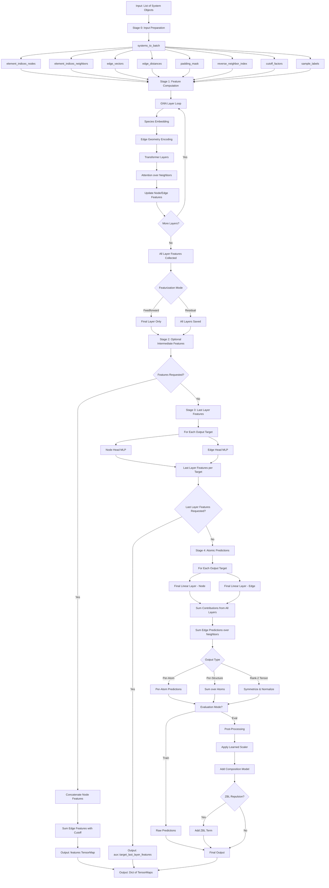

# PET Model Data Flow Documentation

## Overview

PET (Point Edge Transformer) is a Graph Neural Network (GNN) with attention-based message
passing designed for equivariant molecular and materials modeling. This document describes
the complete data flow through the PET model architecture.

## Architecture Summary

PET processes atomic systems through a multi-stage pipeline that transforms atomic
positions and species into predictions for various properties (energy, forces, stress,
etc.). The model uses Cartesian transformers with bidirectional message passing over
neighbor lists.

## Complete Data Flow Diagram



## Detailed Stage-by-Stage Breakdown

### Stage 0: Input Preparation

**Function:** `systems_to_batch()` in `modules/structures.py`

**Input:**
- List of `metatensor.torch.System` objects
- Each system contains:
  - Atomic positions (Cartesian coordinates)
  - Atomic species (element types)
  - Cell vectors (periodic boundary conditions)
  - Pre-computed neighbor lists

**Process:**
1. Flatten all systems into a single batch
2. Extract neighbor information from pre-computed lists
3. Compute edge vectors and distances
4. Apply cutoff function for smooth distance weighting
5. Create reverse neighbor mapping for bidirectional message passing
6. Generate padding masks for variable-sized neighborhoods

**Output Tensors:**

| Tensor | Shape | Description |
|--------|-------|-------------|
| `element_indices_nodes` | `[n_atoms]` | Species of central atoms |
| `element_indices_neighbors` | `[n_atoms, max_neighbors]` | Species of neighboring atoms |
| `edge_vectors` | `[n_atoms, max_neighbors, 3]` | Cartesian edge vectors (r_j - r_i) |
| `edge_distances` | `[n_atoms, max_neighbors]` | Pairwise distances ‖r_j - r_i‖ |
| `padding_mask` | `[n_atoms, max_neighbors]` | Boolean mask for padded neighbors |
| `reverse_neighbor_index` | `[n_edges]` | Maps each i→j edge to its j→i counterpart |
| `cutoff_factors` | `[n_atoms, max_neighbors]` | Smooth cutoff weights f_c(r_ij) |
| `sample_labels` | `[n_atoms, 2]` | (system_idx, atom_idx) for metatensor format |

### Stage 1: Feature Computation via GNN Layers

**Function:** `_calculate_features()` in `model.py`

**Process:**

#### Initial Embedding
1. Embed atomic species → initial node features (dimension: `d_node`)
2. Embed edge information → initial edge features (dimension: `d_pet`)

#### GNN Layer Iteration
For each of `num_gnn_layers` layers:

1. **Edge Geometry Encoding:**
   ```
   edge_features = MLP([edge_vector, edge_distance, neighbor_species])
   Output dimension: d_pet
   ```

2. **Transformer Processing:**
   - Multi-head attention over neighbors
   - Attention scores weighted by cutoff factors
   - Separate attention for nodes and edges
   - Feedforward MLPs with residual connections

3. **Feature Updates:**
   ```
   node_features_new = Transformer(node_features, edge_features)
   edge_features_new = Transformer(edge_features, node_features)
   ```

4. **Bidirectional Message Passing:**
   - Uses `reverse_neighbor_index` to aggregate messages from both directions
   - **Feedforward Mode:** Combines forward + reversed messages via `combination_mlps`
   - **Residual Mode:** Averages forward + reversed messages, saves all layer features

5. **Optional Long-Range Interactions:**
   - Ewald summation or P3M for electrostatic contributions (if enabled)

#### Featurization Strategies

**Feedforward Mode:**
- Only final layer features are retained
- Bidirectional info via explicit message reversal
- Memory efficient for deep networks

**Residual Mode:**
- All intermediate layer features preserved
- Concatenated for final predictions
- Richer feature set but higher memory cost

**Output:**
- Node features from all layers: `List[Tensor[n_atoms, d_node]]`
- Edge features from all layers: `List[Tensor[n_atoms, max_neighbors, d_pet]]`

### Stage 2: Intermediate Feature Output (Optional)

**Condition:** If "features" is in `requested_outputs`

**Process:**
1. **Node Features:**
   ```
   all_node_features = concatenate([layer1_nodes, layer2_nodes, ..., layerN_nodes], dim=-1)
   Output shape: [n_atoms, d_node * num_gnn_layers]
   ```

2. **Edge Features:**
   ```
   # Sum edge features over neighbors with cutoff weighting
   aggregated_edges = sum(edge_features * cutoff_factors[:, :, None], dim=neighbors)
   all_edge_features = concatenate([layer1_edges, layer2_edges, ..., layerN_edges], dim=-1)
   Output shape: [n_atoms, d_pet * num_gnn_layers]
   ```

3. **Combine:**
   ```
   features = concatenate([all_node_features, all_edge_features], dim=-1)
   ```

**Output:**
- `TensorMap` with key "features"
- Per-atom representations of dimension: `(d_node + d_pet) * num_gnn_layers`
- Useful for transfer learning, dimensionality reduction, or analysis

### Stage 3: Last Layer Feature Computation

**Function:** `last_layer_features()` in `model.py`

**Purpose:** Generate output-specific features for each prediction target

**Process:**

For each output target (e.g., "mtt::energy", "mtt::forces"):

1. **Node Head Processing:**
   ```
   node_last_features = []
   for layer in layers:
       h = NodeHeadMLP[target](layer.node_features)  # d_node → d_head
       node_last_features.append(h)
   Output shape per layer: [n_atoms, d_head]
   ```

2. **Edge Head Processing:**
   ```
   edge_last_features = []
   for layer in layers:
       h = EdgeHeadMLP[target](layer.edge_features)  # d_pet → d_head
       # Sum over neighbors with cutoff weighting
       h_aggregated = sum(h * cutoff_factors[:, :, None], dim=neighbors)
       edge_last_features.append(h_aggregated)
   Output shape per layer: [n_atoms, d_head]
   ```

3. **Combine Node and Edge Contributions:**
   ```
   last_layer_features = [node_last_features, edge_last_features]
   ```

**Output:**
- For each target, two lists of tensors (node and edge contributions)
- Each list has length `num_gnn_layers`
- Each tensor has shape `[n_atoms, d_head]`
- Optionally output as "mtt::aux::{target}_last_layer_features" TensorMap

### Stage 4: Atomic Predictions

**Function:** Final linear layers in forward pass

**Process:**

For each output target:

1. **Apply Final Linear Projections:**
   ```
   node_predictions = []
   edge_predictions = []
   
   for layer_idx in range(num_gnn_layers):
       # Node contribution
       node_pred = FinalLinear_Node[target](node_last_features[layer_idx])
       node_predictions.append(node_pred)
       
       # Edge contribution
       edge_pred = FinalLinear_Edge[target](edge_last_features[layer_idx])
       edge_predictions.append(edge_pred)
   ```

2. **Aggregate Across Layers:**
   ```
   total_prediction = sum(node_predictions) + sum(edge_predictions)
   ```

3. **Handle Output Granularity:**
   - **Per-atom outputs** (forces, per-atom energy): Keep as is
   - **Per-structure outputs** (total energy): Sum over atoms in each system
   - **Rank-2 tensors** (stress, virial): Symmetrize and normalize by volume

4. **Format as TensorMap:**
   ```
   output = TensorMap(
       keys=Labels(...),
       blocks=[
           TensorBlock(
               values=predictions,
               samples=sample_labels,
               components=[Labels(["xyz"])] if Cartesian else [],
               properties=Labels([("properties", str(i)) for i in range(dim)])
           )
       ]
   )
   ```

**Output Dimensions:**

| Output Type | Shape | Description |
|-------------|-------|-------------|
| `mtt::energy` | `[n_systems, 1]` | Per-structure energy |
| `mtt::forces` | `[n_atoms, 3]` | Per-atom forces (Cartesian) |
| `mtt::stress` | `[n_systems, 3, 3]` | Per-structure stress tensor |
| `mtt::virial` | `[n_systems, 3, 3]` | Per-structure virial tensor |
| Custom properties | Varies | User-defined targets |

### Post-Processing (Evaluation Mode Only)

**Function:** `forward()` in `model.py`

**Process:**

1. **Scaling:**
   ```
   scaled_prediction = scaler.scale(raw_prediction)
   ```
   Uses learned per-target mean and standard deviation

2. **Additive Contributions:**
   ```
   prediction += composition_model(species_counts)
   ```
   Adds learned per-species baseline energies

3. **Short-Range Repulsion (Optional):**
   ```
   if use_zbl:
       prediction += zbl_repulsion(positions, species)
   ```
   Adds Ziegler-Biersack-Littmark repulsive potential at short distances

**Final Output:**
```python
Dict[str, TensorMap] = {
    "mtt::energy": TensorMap(...),
    "mtt::forces": TensorMap(...),
    "mtt::stress": TensorMap(...),
    "features": TensorMap(...),  # if requested
    "mtt::aux::energy_last_layer_features": TensorMap(...),  # if requested
    ...
}
```

## Key Architectural Components

### 1. CartesianTransformer

**Location:** `modules/transformer.py`

**Role:** Main GNN layer that performs attention-based message passing

**Structure:**
- Stack of `TransformerLayer` modules
- Each layer has:
  - Multi-head attention block
  - Feedforward MLP
  - Layer normalization (PreLN or PostLN)
  - Residual connections

**Key Features:**
- Operates on both node and edge features simultaneously
- Attention scores weighted by learned cutoff factors
- Separate attention heads for different feature channels

### 2. AttentionBlock

**Location:** `modules/transformer.py`

**Role:** Implements multi-head attention with geometric weighting

**Process:**
```
Query, Key, Value = Linear(features)
Attention_scores = softmax(Query @ Key.T / sqrt(d_k)) * cutoff_factors
Output = Attention_scores @ Value
```

**Variants:**
- Standard attention: Uniform weighting across heads
- Gated attention: Learned per-head weighting

### 3. FeedForward Networks

**Location:** `modules/transformer.py`

**Role:** Non-linear feature transformation

**Architectures:**
- **Standard:** `Linear → Activation → Linear`
- **SwiGLU:** `(Linear → SiLU) * Linear → Linear` (gated variant)

**Activations:** SiLU (Swish), GELU, or custom

### 4. Cutoff Functions

**Location:** `modules/utilities.py`

**Role:** Smooth distance-based weighting

**Types:**
- **Bump:** Polynomial cutoff with continuous derivatives
- **Cosine:** `0.5 * (1 + cos(π * r / r_cutoff))`

**Purpose:**
- Gradually turn off interactions beyond cutoff radius
- Ensures smoothness of energy surface
- Prevents discontinuities in forces

### 5. Bidirectional Message Passing

**Mechanism:** Uses `reverse_neighbor_index`

**Process:**
```
# Forward pass: i → j
forward_messages = compute_messages(i, j)

# Reverse pass: j → i
reverse_messages = compute_messages(j, i)[reverse_neighbor_index]

# Combine
combined = combine_function(forward_messages, reverse_messages)
```

**Benefits:**
- Ensures information flows in both edge directions
- Improves representation power
- Maintains permutation equivariance

## Input/Output Specifications

### Input Format

**Type:** `List[metatensor.torch.System]`

**Required Attributes:**
- `positions`: `Tensor[n_atoms_in_system, 3]` - Cartesian coordinates
- `types`: `Tensor[n_atoms_in_system]` - Atomic species (integer indices)
- `cell`: `Tensor[3, 3]` - Periodic cell vectors (optional for molecules)
- `neighbor_lists`: Pre-computed using `metatensor.operations.neighbors`

**System Object Structure:**
```python
System(
    positions=torch.tensor([[0.0, 0.0, 0.0], [1.5, 0.0, 0.0]]),
    types=torch.tensor([1, 8]),  # H, O
    cell=torch.tensor([[10.0, 0.0, 0.0], [0.0, 10.0, 0.0], [0.0, 0.0, 10.0]]),
    pbc=torch.tensor([True, True, True])
)
```

### Output Format

**Type:** `Dict[str, metatensor.torch.TensorMap]`

**TensorMap Structure:**
```python
TensorMap(
    keys=Labels(["species"]),  # Block-sparse keys
    blocks=[
        TensorBlock(
            values=Tensor[n_samples, ...],  # Predicted values
            samples=Labels(["system", "atom"]),  # Sample indices
            components=[Labels(["xyz"])] if Cartesian else [],  # Cartesian components
            properties=Labels([("property", str(i)) for i in range(n_features)])
        )
    ]
)
```

**Supported Outputs:**

| Key | Description | Per-Atom | Components | Properties |
|-----|-------------|----------|------------|------------|
| `mtt::energy` | Total energy | No | - | [1] |
| `mtt::forces` | Atomic forces | Yes | [xyz] | [3] |
| `mtt::stress` | Stress tensor | No | [xyz_1, xyz_2] | [3, 3] |
| `mtt::virial` | Virial tensor | No | [xyz_1, xyz_2] | [3, 3] |
| `features` | Intermediate representations | Yes | - | [n_features] |
| `mtt::aux::{target}_last_layer_features` | Last layer features | Yes | - | [d_head] |

## Model Hyperparameters

### Architecture Parameters

| Parameter | Type | Default | Description |
|-----------|------|---------|-------------|
| `d_pet` | int | 128 | Edge feature dimension |
| `d_node` | int | 128 | Node feature dimension |
| `d_head` | int | 64 | Output head dimension |
| `num_gnn_layers` | int | 3 | Number of GNN iterations |
| `num_transformer_layers` | int | 2 | Transformers per GNN layer |
| `num_attention_heads` | int | 8 | Multi-head attention heads |
| `r_cutoff` | float | 5.0 | Interaction cutoff radius (Å) |

### Training Parameters

| Parameter | Type | Default | Description |
|-----------|------|---------|-------------|
| `featurization_mode` | str | "residual" | "feedforward" or "residual" |
| `transformer_type` | str | "PostLN" | "PostLN" or "PreLN" normalization |
| `activation` | str | "SiLU" | Activation function |
| `use_zbl` | bool | False | Add ZBL short-range repulsion |
| `long_range` | str | None | "Ewald" or "P3M" for electrostatics |

## Performance Considerations

### Memory Usage

- **Feedforward mode:** O(n_atoms * d_node)
  - Only stores final layer features
  - Suitable for very deep networks

- **Residual mode:** O(n_atoms * d_node * num_gnn_layers)
  - Stores all intermediate features
  - Better accuracy but higher memory cost

### Computational Complexity

- **Per GNN Layer:** O(n_atoms * max_neighbors * d_node²)
  - Dominated by attention and feedforward MLPs
  - Scales linearly with system size for fixed cutoff

- **Neighbor List:** Pre-computed, not part of forward pass
  - Use metatensor's neighbor list utilities
  - Rebuild only when atoms move significantly

### Optimization Tips

1. **Batch Size:** Larger batches improve GPU utilization
2. **Cutoff Radius:** Smaller cutoff reduces neighbors, speeds up computation
3. **Feature Dimensions:** Balance between accuracy and speed
4. **Number of Layers:** More layers ≈ more expressivity but slower

## Code Examples

### Basic Usage

```python
from metatrain.pet import Model
import torch

# Create model
model = Model(
    capabilities={
        "outputs": {
            "mtt::energy": {"per_atom": False},
            "mtt::forces": {"per_atom": True},
        }
    },
    hypers={
        "d_pet": 128,
        "d_node": 128,
        "num_gnn_layers": 3,
        "r_cutoff": 5.0,
    }
)

# Forward pass
systems = [...]  # List of metatensor.torch.System objects
requested_outputs = {"mtt::energy": model.capabilities.outputs["mtt::energy"]}

outputs = model.forward(
    systems=systems,
    requested_outputs=requested_outputs,
    is_training=True,
)

# Access predictions
energy = outputs["mtt::energy"]  # TensorMap
print(energy.block(0).values)  # Predicted energies
```

### Extract Intermediate Features

```python
# Request intermediate features
requested_outputs = {
    "mtt::energy": model.capabilities.outputs["mtt::energy"],
    "features": model.capabilities.outputs["features"],
}

outputs = model.forward(systems, requested_outputs, is_training=False)

# Access features
features = outputs["features"]
feature_values = features.block(0).values  # [n_atoms, d_node * num_gnn_layers]
```

### Use Last Layer Features

```python
# Request last layer features for energy prediction
requested_outputs = {
    "mtt::energy": model.capabilities.outputs["mtt::energy"],
    "mtt::aux::energy_last_layer_features": 
        model.capabilities.outputs["mtt::aux::energy_last_layer_features"],
}

outputs = model.forward(systems, requested_outputs, is_training=False)

# Access last layer features
last_features = outputs["mtt::aux::energy_last_layer_features"]
```

## References

- **PET Paper:** [Point Edge Transformer](https://arxiv.org/abs/2305.19302)
- **Metatensor Documentation:** https://lab-cosmo.github.io/metatensor/
- **Metatrain Repository:** https://github.com/lab-cosmo/metatrain

## Contributing

When modifying the PET architecture:

1. Maintain backward compatibility for checkpoints via `upgrade_checkpoint()`
2. Update `__checkpoint_version__` if data format changes
3. Add tests in `pet/tests/` following existing patterns
4. Document new hyperparameters in `documentation.py`
5. Run full test suite: `tox -e pet-tests`

## Troubleshooting

### Common Issues

**OOM Errors:**
- Reduce `d_pet`, `d_node`, or batch size
- Switch from "residual" to "feedforward" mode
- Decrease `num_gnn_layers`

**Slow Training:**
- Reduce `r_cutoff` to decrease neighbor counts
- Use fewer attention heads (`num_attention_heads`)
- Profile with PyTorch profiler to identify bottlenecks

**NaN Losses:**
- Check input data for invalid values (inf, nan)
- Reduce learning rate
- Increase `r_cutoff` smoothly (don't use sharp cutoffs)
- Verify neighbor lists are correct

**Checkpoint Loading Errors:**
- Check `__checkpoint_version__` mismatch
- Use `Model.load_checkpoint()` instead of raw `torch.load()`
- Verify model hyperparameters match saved checkpoint
